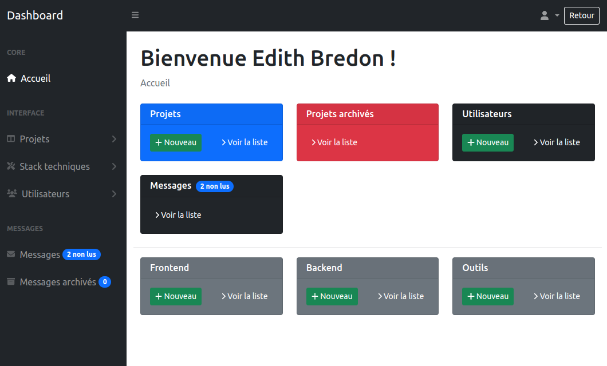

# Backoffice - Symfony 6

Ce projet est mon backoffice réalisé avec Symfony 6 pour la gestion de mes projets. Il est déployé sur Hostinger et utilise Bootstrap et le template Twig pour la vue. Le site est accessible à l'adresse suivante : https://backoffice.edithbredon.fr. Il a pour objectif de fournir une interface d'administration pour gérer mes projets et les routes API de mon portfolio: https://edithbredon.fr.

## Technologies utilisées

- [Symfony 6](https://symfony.com/)
- [PHP 8](https://www.php.net/)
- [Composer](https://getcomposer.org/)
- [MySQL](https://www.mysql.com/)
- [Twig](https://twig.symfony.com/)
- [Bootstrap](https://getbootstrap.com/)
- [Hostinger](https://www.hostinger.fr/) (hébergement)

## Fonctionnalités

- CRUD projets + clone d'un projet
- CRUD technologies
- CRUD utilisateurs
- Formulaire de contact avec Google reCAPTCHA
- Liste des messages reçus via le formulaire de contact
- Archivage d'un message 
- Suppression d'un message
- Gestion des routes API + mise en cache des données pour des performances optimales
- Tests unitaires et fonctionnels avec PHPUnit, lancer les tests avec la commande `composer test` ([voir documentation de Symfony pour la configuration des tests](https://symfony.com/doc/current/the-fast-track/fr/17-tests.html))

- Test coverage avec PHPUnit, lancer la vérification avec la commande `composer coverage`, permet de vérifier la couverture des tests unitaires et fonctionnels.
- Qualité du code avec PHPStan (norme PSR-12), lancer la vérification avec la commande `composer phpstan`

## Installation

1. Clonez le dépôt: `git clone https://github.com/edithbdev/backoffice.git`
2. Installez les dépendances: `composer install`
3. Installez les dépendances javascript: `npm install`
4. Configurez les variables d'environnement en créant un fichier `.env.local` à la racine du projet. Vous pouvez vous baser sur le fichier `.env` pour les variables à définir.
5. Créez la base de données: `php bin/console doctrine:database:create`
6. Lancez les migrations: `php bin/console doctrine:migrations:migrate`
7. Chargez les fixtures (données de test): `php bin/console doctrine:fixtures:load`

## Utilisation

1. Démarrez l'application: `symfony server:start`
2. Ouvrez votre navigateur et allez sur `http://localhost:8000`

## Exemple : ajout d'un projet

## Déploiement

Le déploiement est automatique sur Hostinger via GitHub Actions lorsqu'un commit est effectué sur la branche main. Les fichiers de configuration se trouvent dans le dossier `.github/workflows`.

## Auteur

Edith Bredon - [edithbredon.fr](https://www.edithbredon.fr/)